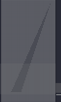

# C练习题

## Exercise 1

### 题目

一张1000*1000的白色图片，任意输入三个点的坐标(x1,y1),(x2,y2),(x3,y3)，将三个点组成的三角形涂成黑色。注：白色用0表示，黑色用1表示。


### 程序运行

进入exercise1目录下，

```cmd
# 默认文件保存在img/pic.txt下
bash sh/main.sh
# 设置保存到img/下的指定文件
bash sh/main.sh <filename>
```


###  测试用例

#### **1. 坐标边界测试**

| 点坐标输入 |                      输出信息                      |        非法表达式说明        |
| :--------: | :------------------------------------------------: | :--------------------------: |
|   -1 10    | 坐标值有误，横纵坐标的范围（0~1000），请重新输入！ | 横纵坐标的范围不在0~1000之内 |
|   1 1001   | 坐标值有误，横纵坐标的范围（0~1000），请重新输入！ | 横纵坐标的范围不在0~1000之内 |

#### 2. 三点是否组成三角形测试

<table>
    <tr align="center">
        <th>三个点坐标输入</th>
        <th>输出信息</th>
        <th>非法表达式说明</th>
    </tr>
    <tr align="center">
        <td>10 10</td>
        <td rowspan=3>输入的三个点不能组成三角形！</td>
        <td rowspan=3>三个点不能组成三角形</td>
    </tr>
    <tr align="center">
        <td>20 10</td>
    </tr>
    <tr align="center">
        <td>30 10</td>
    </tr>
</table>

#### 3. 生成三角形测试

<table>
    <tr align="center">
        <th>三个点坐标输入</th>
        <th>输出信息(左下角为坐标原点)</th>
    </tr>
    <tr align="center">
        <td>10 10</td>
        <td rowspan=3></img></td>
    </tr>
    <tr align="center">
        <td>20 10</td>
    </tr>
    <tr align="center">
        <td>50 100</td>
    </tr>
	<tr align="center">
        <td>0 0</td>
        <td rowspan=3></img></td>
    </tr>
    <tr align="center">
        <td>0 50</td>
    </tr>
    <tr align="center">
        <td>30 80</td>
    </tr>
</table>


## Exercise 2

### 题目

编写一个提供加减乘除和括号功能的计算器。


### 程序运行

进入exercise2目录下，执行

```cmd
bash sh/main.sh
```


### 测试用例

#### **1. 无效表达式测试**

|  表达式输入  |                             输出                             |      非法表达式说明      |
| :----------: | :----------------------------------------------------------: | :----------------------: |
|    1+a+2     | Illegal characters in the input maths formula string. please re-enter it. |       包含无效字符       |
|     1++2     | Illegal characters in the input maths formula string. please re-enter it. |    存在多个连续运算符    |
|   1*2.2.2    | Illegal characters in the input maths formula string. please re-enter it. |   操作数存在多个小数点   |
|   1+2 2*5    |               Maths formula formatting errors!               |    操作数中间存在空格    |
|   1*2=3+2    | Illegal characters in the input maths formula string. please re-enter it. | 赋值符号右边存在其他字符 |
|    1*02-3    | Illegal characters in the input maths formula string. please re-enter it. | 两位数以上操作数以0开头  |
|   4 / 2 +    | Illegal characters in the input maths formula string. please re-enter it. |      末尾多余运算符      |
|   2 + * 3    |           Input Formula error! Please re-enter it.           |      非法符号和运算      |
| 2 * (4 - 1)) | Maths formula formatting error: left and right brackets don't match! |       无效括号匹配       |
|    3 * ()    |               Maths formula formatting errors!               |       多余的空括号       |
|    2. + 5    | Illegal characters in the input maths formula string. please re-enter it. |       多余的小数点       |


#### 2. 基本算术运算

##### **2.1 整数四则运算**

| 表达式输入 | 预期输出（小数默认保留五位） |         真实输出         |
| :--------: | :--------------------------: | :----------------------: |
|  -55+11=   |             -44              |           -44            |
|  100-78=   |              22              |            22            |
|   15*55    |             825              |           825            |
|  20/100=   |           0.20000            |         0.20000          |
|    5/0     |   Error: division by zero.   | Error: division by zero. |


##### 2.2 小数四则运算

| 表达式输入 | 预期输出（小数默认保留五位） |         真实输出         |
| :--------: | :--------------------------: | :----------------------: |
| 2.0 +13.5  |           15.50000           |         15.50000         |
| 0.56-0.258 |           0.30200            |         0.30200          |
| 0.85*5.56  |           4.72600            |         4.72600          |
| 125.9/0.05 |             2518             |           2518           |
|  5.5/0.0   |   Error: division by zero.   | Error: division by zero. |


##### 2.3 括号运算

|                 表达式输入                  | 预期输出（小数默认保留五位） | 真实输出 |
| :-----------------------------------------: | :--------------------------: | :------: |
|                 (3 + 4) * 2                 |              14              |    14    |
|              2 * (5 - (3 + 1))              |              2               |    2     |
|                (7.3-4.1)/0.5                |           6.40000            | 6.40000  |
|                 125.9/0.05                  |             2518             |   2518   |
|               -1.5*(0.2-0.3)                |           0.15000            | 0.15000  |
|                 5.6-(-3.2)                  |           8.80000            | 8.80000  |
|            2.5+3.7/(1.2-0.3)*5.0            |           23.05555           | 23.05555 |
|           2.5\*3.7/(1.2/0.3)*5.0=           |           11.56250           | 11.56250 |
| (3.5+2.7)\*(4.2-1.8)/(0.5*2)+(7.6-3.4)\*1.5 |           21.18000           | 21.18000 |
|             (3+4)(5-2)/(2(7-3))             |           2.62500            | 2.62500  |
|              10(20+20)-90*1.8               |             238              |   238    |
